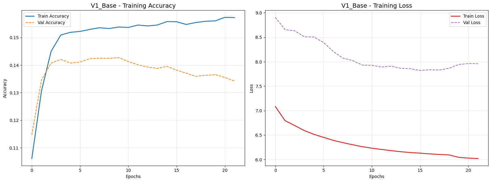

# Mimicry V1: Human-Centric Persona Synthesis Framework
 Mimicry V1 is a foundational Natural Language Processing (NLP) framework developed to analyze and replicate specific human conversational styles. This project serves as the baseline iteration for creating "Digital Twins"—AI agents capable of mirroring the linguistic nuances, tone, and behavioral patterns of a specific individual.

### Project Overview
Unlike generic AI assistants, this project explores identity-consistent AI by establishing a robust pipeline for persona grounding. V1 focuses on analyzing messaging data to capture unique slang, sentence structures, and contextual habits.

### Core Features
**Persona Grounding Pipeline**: Efficiently converts raw messaging exports into structured, high-quality training pairs.

**Heuristic Slang Mapping**: A custom processing layer designed to handle informal Indonesian language and unique text-based expressions.

**Contextual Persistence**: Utilizes a 3-layer LSTM architecture to maintain identity consistency throughout a conversation thread.

**Modular Configuration**: Employs a dedicated CFG system for seamless adjustment of hyperparameters, including dropout rates, embedding dimensions, and sampling temperature.

### Tech Stack
**Language**: Python 3.10

**Deep Learning Framework**: TensorFlow 2.15.0 & Keras

**Visualization**: Matplotlib

**Data Processing**: NumPy, Regex, & Pickle
### Training Results

### Model Performance Analysis
Based on the current iteration (V1), the model shows the following characteristics:
* **Accuracy Metrics**: The validation accuracy peaks at approximately **14.2%** around epoch 9 before showing signs of divergence.
* **Sparse Data Impact**: The relatively low accuracy and high loss are expected results of a **Sparse Dataset** where the variety of conversational responses is high compared to the number of training samples.
* **Learning Convergence**: Despite the low absolute accuracy, the **Training Loss** consistently decreases from ~7.1 to ~6.0, indicating that the model is successfully learning the underlying linguistic patterns of the persona.
* **Convergence Note**: Validation loss starts to plateau/increase after epoch 15, marking the optimal stopping point for the current architecture to avoid over-memorization.

### Project Structure
├── *mimicry_v1_model_train(code).ipynb*  # Core training and inference logic

├── *README.md*                           # Project documentation

├── *.gitignore*                          # Privacy and junk file filter

└── *LICENSE*                             # MIT License

### Privacy & Ethics
This repository **does not contain any private datasets**. The framework is designed to be used with the user's own data, emphasizing ethical AI usage and data privacy as core development principles.

## Developed by **Adrian Marcello B** - Computer Science Student at *BINUS University*
